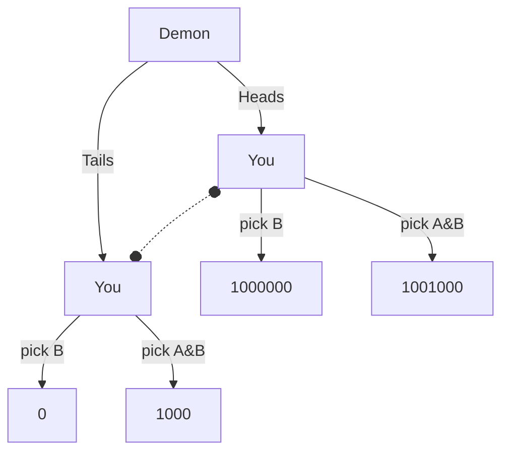

# Decision Theory Problems

Decision theory problems are usually presented as a story. In this story, the agents and their motives are described. The story gives enough information for you to figure out payoffs for each agent, often as explicit numerical values but sometimes implicitly.

Once you have the decision problem story, you can convert it into normal or extensive forms to help figure out what each player should do. These conversions sometimes differ depending on which decision theory you're analyzing. 

## Normal Form

The normal form of a game formats the decisions as a table. Traditionally, a two player game's normal form lists one player's decisions along the top and the other player's decisions along the left side. Each cell in the resulting table shows payoffs for both players.

| | Player 2 Decision A | Player 2 Decision B |
|---|---|---|
| Player 1 Decision 1 | P1 value = -1, P2 value = -1 | -3, 0 |
| Player 1 Decision 2  | 0, -3 | **-2, -2** |

Note that one of the cells in the above table is bolded. That cell is the Nash equilibrium for the problem. A Nash equilibrium is a set of decisions that provide payouts neither player could improve on by only changing their own actions. Any cell that isn't the Nash equilibria is one where a player can change only their own decision and potentially do better.

Problems can have 0, 1, or many Nash equilibria.

## Extensive Form

The extensive form of a game is often used to show how player's decisions are made through time. For example, some games involve one player making a decision, then another player responding after seeing the first play.

The extensive form has a node for each way that the world could be. For example, in a coin flipping game there would be a node for the coin coming up heads and another where it came up tails. In each node, a player must make a decision that results in a new world state. These decisions are represented in the diagram as lines or arrows that come out of the player's state and go into the new state their decision creates. Nodes are often labeled with who is making the decision, and arrows are often labeled with what the decision is. The diagram often terminates with payouts that result from a given course of play.

While each node represents a different state of the world, the player making a decision may not have enough information to know which node they're in. For example, if a coin is tossed but the player must make a decision before seeing the result. There are two different world-states, but the player is ignorant of which they're in. This is represented as an "information set": the set of all world-states the player believes they may be in.

In an extensive diagram, an information set is represented by linking nodes together via dotted lines.
