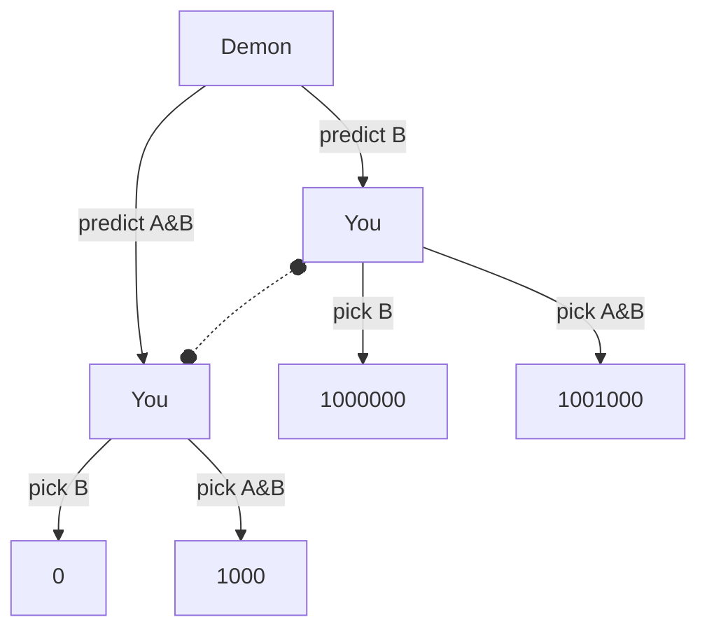

# Newcomb's Problem

There's a demon who is extremely good at predicting what people do. The demon places money in two boxes, A and B. It places $1000 in box A. If it predicts that you'll only take box B, then it also places $1000000 in box B. If it predict that you'll take both boxes, then it leaves box B empty.

After the demon fills the boxes, you get to decide which boxes to take.

## Normal Form Game

| | Demon predicts B | Demon predicts A&B |
|---|---|---|
| You take B | $1000000 | 0 |
| You take A&B  | $1001000 | $1000 |

## Extensive Form Game

Note that nodes with a dotted line between them are in the same information set. The decider in those nodes doesn't know which world they're in.

## Solutions in various Decision Theories

### CDT

The Causal Decision Theorist reasons that the demon has already placed money in the boxes. Nothing that the decider does now can change what the demon has already done. That being the case, taking only one box is leaving money on the table.

The CDT agent always takes both boxes.
