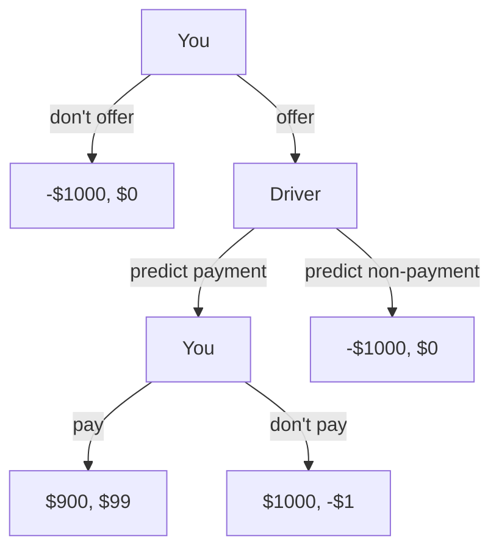

# Parfit's Hitchhiker

Your car breaks down as you're driving through a desert. You're stranded there and don't see a way to get out before you die of thirst. Suddenly, a car comes driving down the road. It stops and the driver leans out to talk to you.

The driver says "I'll give you a ride to town for $100."

When you tell the driver you don't have any money on you, the driver responds "That's ok, I'll take you to an ATM as soon as we get to town and you can pay me then."

Before you can answer, the driver continues "You should know that I'm a perfect predictor, and I know whether you'll really pay me. If I predict you won't pay me, then I won't drive you to town."

You know this is your last chance, and you will surely die if the driver doesn't take you to town. What do you say to the driver?

## Normal Form Game

There are two time points at which you are making a decision. One is when you're in the desert answering the driver. The other is when you're in town (if you make it there) withdrawing money from the ATM.

### Normal Form in the Desert

Assumptions:
* it costs the driver $1 to drive you to town
* you value your life at $1000

| | Drives you to town | Doesn't drive you to town |
|---|---|---|
| You offer to pay | **$900, $99** | -$1000, $0 |
| You don't offer to pay  | - | -$1000, $0 |

### Normal Form in the City

Assumptions:
* you're already in town
* you can walk away from the driver without further repurcusions
* it cost the driver $1 to drive you to town
* you value your life at $1000

| | Drives you to town |
|---|---|
| You pay | $900, $99 |
| You don't pay  | **$1000, -$1** |

## Extensive Form Game

## Solutions in various Decision Theories

### CDT

When in the desert, a CDT agent will reason that offering to pay is worth more than not offering to pay. The CDT agent will offer to pay. There's nothing tricky about this, the agent actually does _intend_ to pay when they get to town.

After arriving in town, the CDT agent is faced with a _new_ choice about whether to actually get the money. At this time, the CDT agent will reason that not paying saves $100, and so will not pay.

While in the desert, the CDT agent will offer the money. The driver will then accurately predict that the CDT agent won't actually pay up, and the driver will drive off without the CDT agent.

The result is that the CDT agent dies in the desert.

### EDT

When in the desert, the EDT agent reasons similarly to the CDT agent. Their decision process remains similar when they get to town.

After arriving in town, the EDT agent is faced with the _new_ choice about whether to get the money. One important conditional probability here is on whether the driver has already driven them to town. Specifically:

* Probability the driver drove them into town, given that they are deciding whether to pay = 1

When they are in town deciding whether to pay, their further conditional probabilities now are:

* Probability that they have $100, given that they pay $100 = 0
* Probability that they have $100, given that they don't pay $100 = 1

Since having $100 is better than not, the EDT agent will not pay the driver when they get to the town. The driver will predict this, and will not save the EDT agent.

The result is that the EDT agent dies in the desert.

## References

* [How to solve Parfit's hitchhiker](https://www.cantorsparadise.com/how-to-solve-parfits-hitchhiker-99d9b74a2040)
