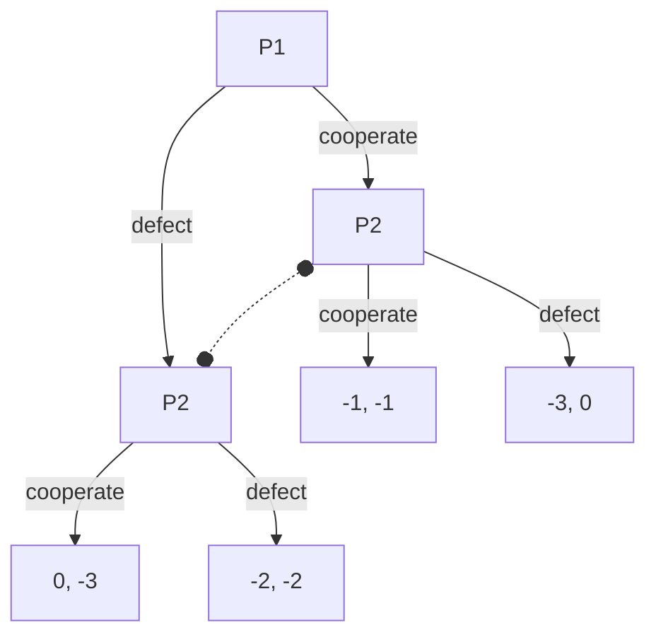

# Prisoner's Dilemma

Two members of a criminal gang are arrested and held in separate cells. Their jailers interrogate them separately, and the prisoners can't communicate. The prisoners know the police don't have enough information to convict them of a large crime they committed, but they could each be convicted of a smaller crime.

Their jailers give each prisoner the same choice: if you rat out your partner, we'll let you go and convict him for the big crime. If he rats you out, we'll convict you but not him. If you both rat each other out, we'll let you out a bit early for helping us.

What should each prisoner do?

## Normal Form Game

If a prisoner doesn't rat out their partner, we term that "cooperate". If they do rat out their partner, we term that "defect".

Nash equilibria are bolded.

| | cooperate | defect |
|---|---|---|
| cooperate | -1, -1 | -3, 0 |
| defect  | 0, -3 | **-2, -2** |

## Extensive Form Game

Note that nodes with a dotted line between them are in the same information set. The decider in those nodes doesn't know which world they're in.

## Solutions in various Decision Theories

### CDT

The Causal Decision Theorist reasons that their decision won't change what their partner is doing. They therefore decide simply to maximize their performance in the Normal form game. Regardless of what their partner does, they do better by defecting.

The CDT prisoner always defects.

## Variants

* Repeated: the prisoners repeat the game against each other over and over, and know what was picked in prior games
* Open source: prisoners are programs, and they can view each other's source code before making a decision

## References

* [Prisoner's Dilemma](https://en.wikipedia.org/wiki/Prisoner's_dilemma)
