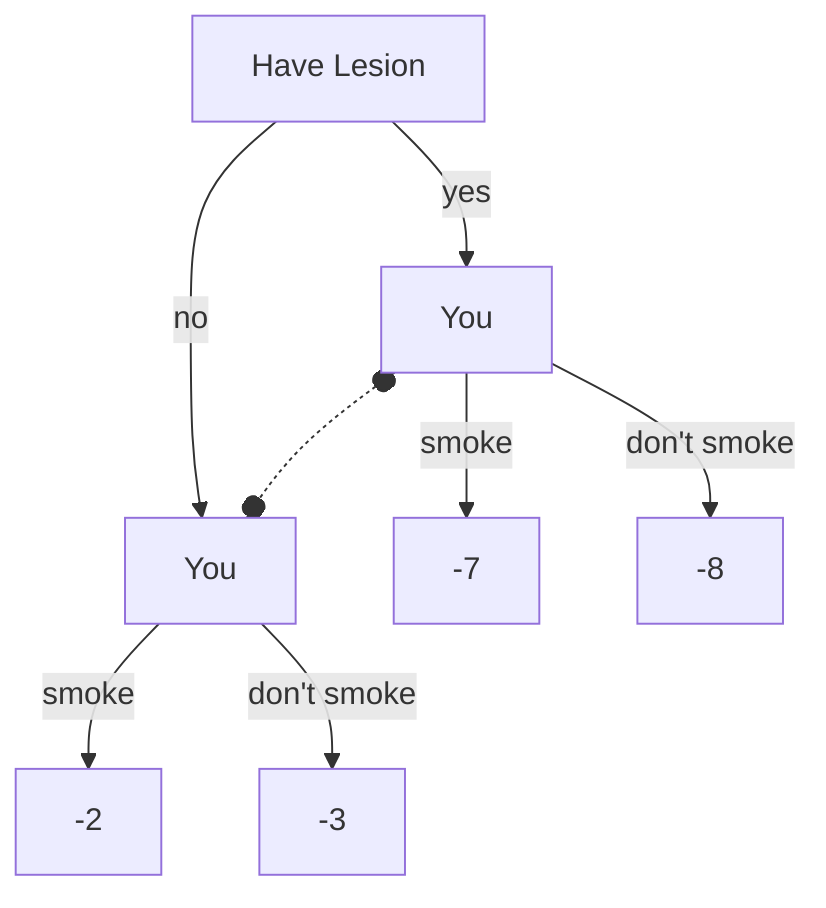

# Smoking Lesion

In this game, the world is very different from our own. Smoking doesn't cause cancer. Instead, desire to smoke and proclivity for cancer are both caused by a genetic lesion.

Assume you enjoy smoking. You also enjoy not having cancer a lot more than you enjoy smoking.

Should you smoke?

## Normal Form Game

Assumptions:
* smoking is worth $1
* cancer is worth -$10
* if you have the lesion, your chance of cancer is 0.8
* if you don't have the lesion, your chance of cancer is 0.3
* 20% of people without the lesion smoke
* 90% of people with the lesion smoke
* use expected value to calculate loss in value due to cancer
* half the people in the world have the lesion

| | lesion | no lesion |
|---|---|---|
| smoke | -7 | -2 |
| don't  | -8 | -3 |

## Extensive Form Game

Note that nodes with a dotted line between them are in the same information set. The decider in those nodes doesn't know which world they're in.

## Solutions in various Decision Theories

### CDT

The Causal Decision Theorist knows that, in this alternate world, there is no causal link between smoking and cancer. Whether the CDT agent has the lesion or not is determined before the they decide whether to smoke. Smoking or not smoking doesn't change their cancer risk.

The CDT agent decides to smoke.

### EDT

The Evidential Decision Theorist has the following conditional probabilities:

* Probability of smoking, given that they have the lesion = 0.9
* Probability of smoking, given that they _don't_ have the lesion = 0.2

* Probability of getting cancer, given that they have the lesion = 0.8
* Probability of getting cancer, given that they _don't_ have the lesion = 0.3

From these, they can calculate:

* Probability of getting cancer, given that they smoke = (0.8\*0.9 + 0.3\*0.2) / (0.9+.03) = 0.65
* Probability of getting cancer, given that they _don't_ smoke = (0.8\*0.1 + 0.3\*0.8) / (0.1+0.8) = 0.35

Once you have the probabilities of getting cancer given that you smoke (which remember is not a causal pathway), you can calculate your expected values by including payoffs for smoking and cancer.

* Expected payoff for smoking: $1 + 0.65*(-$10) = -5.5
* Expected payoff for not smoking: 0.35*(-$10) = -3.5

Therefore the EDT agent will not smoke, even though this doesn't have any causal impact on them getting cancer.

## References

* [Less Wrong Smoking Lesion Page](https://www.lesswrong.com/tag/smoking-lesion)
