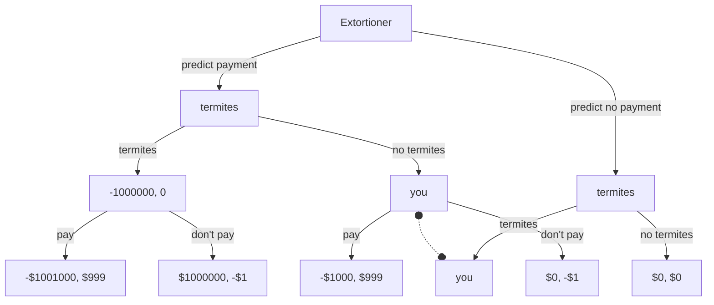

# Termite Extortioner

You hear a rumor that your house has termites. If it does have termites, you know it will cost you $1,000,000 to get all the damage fixed up. You're not sure if the rumor is true, though.

When checking your mail, you find a letter from a known extortioner. Everyone knows that the extortioner is exceptionally greedy and perfectly accurate.

The letter states:

> I know whether your house has termites. I have sent this letter to you if and only if I predict that exactly one of the following is true:
> a) the rumor about your house having termites is false, and you will pay me $1,000 upon receiving this letter
> b) the rumor is true, and you will _not_ pay me $1,000 upon receiving this letter

What do you do in response to the letter?

## Normal Form Game

Assumptions:
* stamps to send letters are $1
* the predictor is perfectly accurate

| | letter / termites | no letter / termites | letter / no termites | no letter / no termites |
|---|---|---|---|---|
| pay the extortioner | -1001000, 999 | - | -1000, 999 | - |
| don't pay  | -1000000, -1 | -1000000, 0 | 0, -1 | 0, 0 |

## Extensive Form Game

Note that nodes with a dotted line between them are in the same information set. The decider in those nodes doesn't know which world they're in.

## Solutions in various Decision Theories

### CDT

The Causal Decision Theorist reasons that their decision won't change whether their house has termites. There's no causal path from deciding to pay (or not pay) the extortioner that impacts whether their house has termites.

Similarly, there's no causal path from deciding to pay to whether the letter gets sent. If you received the letter, nothing you can do now can change whether you recieve it.

Therefore, if you see the letter, you can save $1000 by not paying. Whether you have termites or not doesn't enter into it.

The CDT agent will not send any money to the extortioner.

## References

* [Cheating Death in Damascus](https://intelligence.org/files/DeathInDamascus.pdf)
